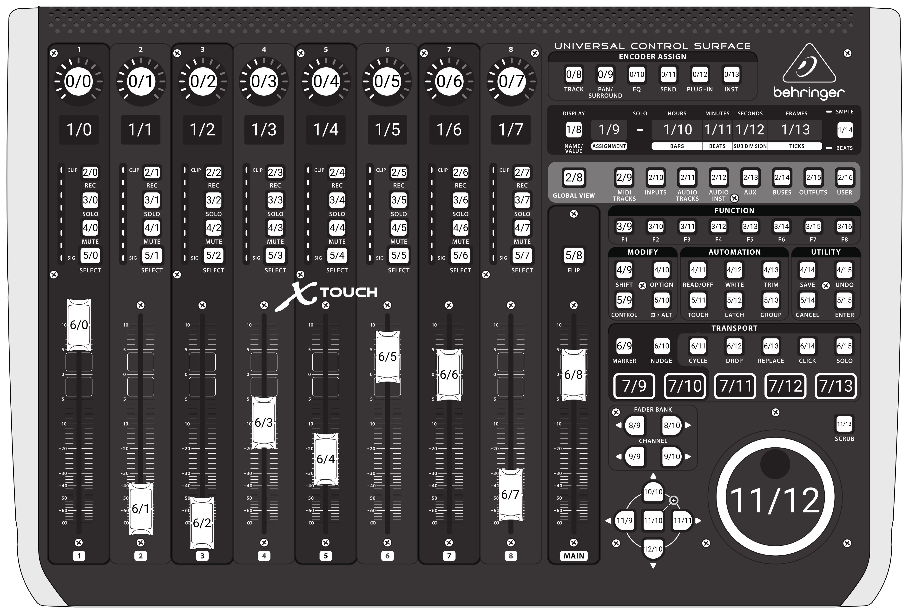
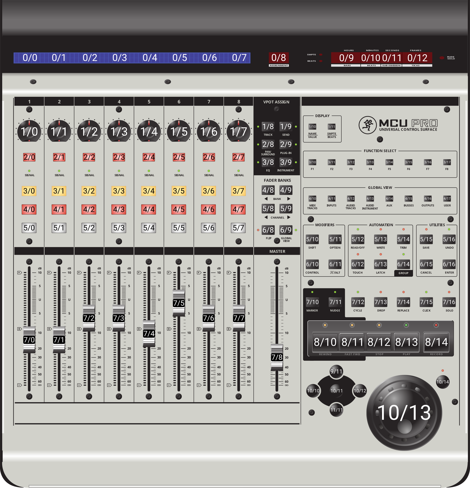

## Mackie Control RTP MIDI

This surface module lets Companion connect to Mackie Control-compatible devices over RTP MIDI. Once connected, the device is exposed as a Companion remote surface so its buttons, encoders, faders, displays, meters, and other controls can be mapped and used as normal.

## Requirements

This module requires at least **Companion version >=5.1.0** (currently in beta) due to relying on added support for LED rings introduced in `@companion-surface/base` version 1.4.0.

## Table of Contents

- [Setup](#setup)
  - [X-Touch Setup](#x-touch-setup)
- [Supported Layouts](#supported-layouts)
- [Controls](#controls)
  - [Buttons](#buttons)
  - [Encoders](#encoders)
  - [Faders](#faders)
  - [Meters](#meters)
  - [LCDs](#lcd-displays)
  - [Segment Displays](#segment-displays)
- [Pincodes](#pincodes)

## Setup

Once the module is installed in Companion, a new remote surface can be added by going to `Surfaces > Remote` and clicking on `Add Remote Surface Connection` and choosing `mcu-rtp-midi`. Afterwards, enter the connection details for the device/RTP MIDI endpoint.

Surface Configuration:

| Field      | Description                                                                                                                                             |
| ---------- | ------------------------------------------------------------------------------------------------------------------------------------------------------- |
| IP Address | The IP address Companion should connect to for the RTP MIDI session                                                                                     |
| Port       | The RTP MIDI port used by the device. Most setups use `5004` (default)                                                                                  |
| Layout     | Chooses how the surface is mapped to the Companion grid. Pick the layout that best matches your device. Alternate layouts are available for each device |

If you are unsure which layout to use, start with `X-Touch`. The combined segment-display variant can be used to control the segment display as one large display instead of multiple individual segments.

### X-Touch Setup

When using a Behringer X-Touch, the device must be configured in MC network slave mode. This mode exposes the X-Touch as an MCU compatible device over the network through RTP MIDI.

This can be configured through the following steps:

1. With the X-Touch off, hold down the select button found in the channel 1 channel strip and then continue holding it while powering on the X-Touch
2. A settings menu should appear on the LCD displays. Make sure the settings are configured as shown below:

   | Name    | Value   |
   | ------- | ------- |
   | Mode    | MC      |
   | Ifc     | Network |
   | Network | Mode    |
   | Role    | SLAVE   |
   | Port    | 5004    |

   DHCP can also be turned on at this stage if desired. The LCD brightness can also be adjusted here too.

3. Once the settings are configured to your liking, press the select button colored green to confirm

4. The LCD displays will show the devices IP. Make sure the device is on the same network as Companion

5. From within Companion, use the shown IP on the device for the `IP Address` setting of the remote surface. Make sure the `Port` setting is set to the same port as configured in step 2 (most likely 5004).

## Supported Layouts

- X-Touch
- X-Touch (Combined Segment Displays)
  

- MCU Pro
- MCU Pro (Combined Segment Displays)
  

## Controls

There are 6 main control types that this module supports: buttons (with LEDs), encoders (with LED rings), faders (with touch detection), meters, LCD displays, and segment displays. This section and following subsections will show how each of these can be configured within Companion.

### Buttons

Buttons are the easiest to setup as they work like normal. Simply add a `Button` on the Companion grid corresponding with the row and column of the button you want to map on your device (refer to [Supported Layouts](#supported-layouts) for the exact row/column mapping).

#### Button LEDs

The MCU protocol supports turning on and off an LED located under most buttons. This can be controlled by adding a `Gauge` under the `Style` tab of the button. A `Value` of `0` indicates that the LED should be off while any value `>= 1` indicates that the LED should be on.

##### LED On While Pressed

To have the LED illuminate only while the button is pressed down, follow the steps below:

1. Create a new `Gauge` under the `Style` tab of the button
2. Under the `Value` section, set the following values:

   | Property | Value |
   | -------- | ----- |
   | Value    | 0     |
   | Minimum  | 0     |
   | Maximum  | 1     |

3. Next under the `Fill` section, remove all color stops except for 1. Set the color of the remaining color stop to white and the `Value` to `1`
4. Now go to the `Feedbacks` tab and add a new feedback. Add `Internal --> Button: When Pressed`
5. Under the `Layered Styles Overrides` section, remove all properties listed
6. Next add a new property `Gauage --> Value` and set the `Value` to `1`

and all set! When the button is held down, you should now see the LED turn on. Keep in mind that while most buttons have an LED on the X-Touch and MCU Pro, there are a few that don't. If you run into any issues feel free to open an issue on GitHub!

##### LED Latch

To have the LED toggle when the button is pressed (to indicate the status of a latch), follow the steps below:

1. Create a new `Gauge` under the `Style` tab of the button
2. Under the `Value` section, set the following values:

   | Property | Value       | Mode       |
   | -------- | ----------- | ---------- |
   | Value    | $(local:on) | Expression |
   | Minimum  | 0           | Value      |
   | Maximum  | 1           | Value      |

3. Next under the `Fill` section, remove all color stops except for 1. Set the color of the remaining color stop to white and the `Value` to `1`
4. Now go to the `Local Variables` tab and add a new variable `internal: User Value`. For this example we'll call it `on`. Feel free to set the `Startup` and `Current` values to your liking
5. Next head to the `Step 1` tab and create a new press action `internal: Local Variable: Set value`. Set the field `Local variable` to the name of our local variable: `on`. Set the `Value` to `1`
6. On the right-hand side of the tab bar use the duplicate step button to duplicate `Step 1`
7. Once duplicated, head to step `2` and change the `Value` of the press action to be `0`

and all set! You should now have a button that will turn on the LED when latched and off when unlatched.

### Encoders

Encoders are relatively simple to setup. Simply add a `Button` on the Companion grid corresponding with the row and column of the encoder you want to map on your device (refer to [Supported Layouts](#supported-layouts) for the exact row/column mapping) and under `Options` turn on `Rotary Actions`. This will let you assign actions for when the encoder is turned to the left or turned to the right. You can also assign a press section which will activate when the encoder is pressed down.

#### Encoder LEDs

The MCU protocol also supports LED rings on each encoder. Just as with the [Button](#button-leds) LEDs, this works through the `Gauge` style. Note that any range of values is supported here. The MCU protocol supports 4 different modes when setting the LEDs:

| Single Mode   | Offset Mode   | Increasing Mode | Centered Mode |
| ------------- | ------------- | --------------- | ------------- |
| `-----------` | `-----------` | `-----------`   | `-----------` |
| `O----------` | `OOOOOO-----` | `O----------`   | `-----O-----` |
| `-O---------` | `-OOOOO-----` | `OO---------`   | `----OOO----` |
| `--O--------` | `--OOOO-----` | `OOO--------`   | `---OOOOO---` |
| `---O-------` | `---OOO-----` | `OOOO-------`   | `--OOOOOOO--` |
| `----O------` | `----OO-----` | `OOOOO------`   | `-OOOOOOOOO-` |
| `-----O-----` | `-----O-----` | `OOOOOO-----`   | `OOOOOOOOOO`  |
| `------O----` | `-----OO----` | `OOOOOOO----`   | `OOOOOOOOOO`  |
| `-------O---` | `-----OOO---` | `OOOOOOOO---`   | `OOOOOOOOOO`  |
| `--------O--` | `-----OOOO--` | `OOOOOOOOO--`   | `OOOOOOOOOO`  |
| `---------O-` | `-----OOOOO-` | `OOOOOOOOOO-`   | `OOOOOOOOOO`  |
| `----------O` | `-----OOOOOO` | `OOOOOOOOOOO`   | `OOOOOOOOOO`  |

This module will automatically determine the best mode to use based on what segments Companion says should be lit. For best results, set the `Gauge` to visibly look close to any of the modes described in the table above. I've found that having the orentiation set to `Horizontal` tends to work best. However, feel free to experiment based on your use case!

### Faders

Faders are on of the few controls in this module which are not mapped to a button in the Companion grid. Their input and output values can be access by navigating to `Surfaces` and clicking on the surface you created during the setup portion of this module. Once online, you'll see a list of input and output values which can be mapped to Companion variables.

Each fader supports mapping it's input and output values as either a percentage or a decibel value based on what's convenient. Keep in mind that when using decibel mode, the dB labels on your surface may not perfectly match the true dB value. If they are widly off please open an issue on GitHub as new layouts can easily be created with different midi to dB and dB to midi mapping functions.

### Meters

Similar to faders, meters are also not mapped to a button in the Companion grid. Their input values are instead directly mapped to Companion variables through the surface's setting page.

Keep in mind that meters are only supported on the X-Touch (due to the MCU Pro not physically having them) and they automatically declay at a rate of about 300ms per division (implemented on the surface hardware level). This behavior should be fine for most use cases, however, if you need them to be steady, then look into creating a `Time Interval: Fixed` trigger which will modify the value of the meter every couple hundred miliseconds by +/- 1. This way the value keeps being refreshed.

### LCD Displays

LCD displays are mapped to the Companion grid as regular buttons (see [Supported Layouts](#supported-layouts) for exact row/column mapping).

Text can be changed by going to the `Button --> Style --> Text` and then updating the `Button text string` value under the `Content` section. Text will automatically wrap from the top line to the bottom line and will be cut off appropriately when longer than the max amount of characters supported by the display.

On the X-Touch, the `Background` style can be used to change the LCD's background color. Since those LCDs only support a limited amount of colors, the module will automatically choose the closest one supported. Keep in mind that if the background is set to black (#000) and text is provided, the background will automatically change to white.

### Segment Displays

Segment displays work very similarly to LCD displays and are also mapped to the Companion grid as regular buttons (see [Supported Layouts](#supported-layouts) for exact row/column mapping).

Since the MCU protocol supports translating ASCII characters to their 8-segment display counterparts, any text can be used. Just like the LCD display, text can be changed by going to the `Button --> Style --> Text` and then updating the `Button text string` value under the `Content` section.

The segment displays also support a `.` in between each number/character. To activate them, simply add a dot in your string. For example, the string `1.2.` will activate the dot between the 1 and the 2 and after the 2. You can also activate just one dot by using the string `1.2` or `12.`.

Each layout type also has a variation which will combine the hours, minutes, seconds, and frames displays into one larger/combined segment display. This makes it easier to show text or long numbers. The row/column of the combined display will use the same row/column of the leftmost display (typically the one labeled `hours` or `bars`).

## Pincodes

All layouts support unlocking the surface through a pincode. Please refer to the following table for how each number is mapped:

| Digit | Button Label |
| ----- | ------------ |
| 0     | Global View  |
| 1     | F1           |
| 2     | F2           |
| 3     | F3           |
| 4     | F4           |
| 5     | F5           |
| 6     | F6           |
| 7     | F7           |
| 8     | F8           |
| 9     | Flip         |
